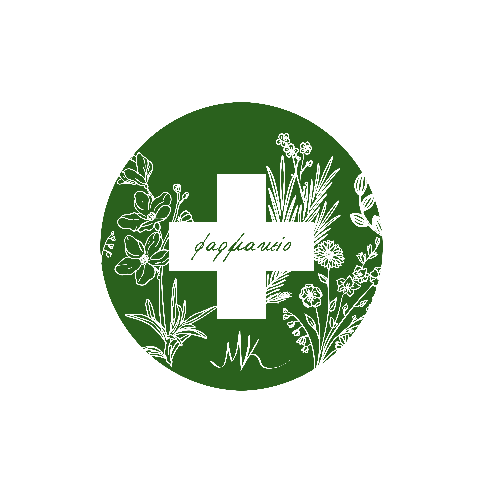

<html lang="el">
<head>
    <meta charset="UTF-8">
    <meta name="viewport" content="width=device-width, initial-scale=1.0">
    <title>Φαρμακειο Μαρια Νικ. Καραμανη | Χανάκια Ηλείας</title>
    <meta name="description" content="Επαγγελματικό φαρμακείο Μαρία Νικ. Καραμάνη στα Χανάκια Ηλείας. Υπηρεσίες υγείας, εμβολιασμοί, δερμοκαλλυντικά.">
    
    <!-- Google Fonts -->
    <link href="https://fonts.googleapis.com/css2?family=Roboto:wght@300;400;700&display=swap" rel="stylesheet">
    <link rel="stylesheet" href="https://cdnjs.cloudflare.com/ajax/libs/font-awesome/6.4.0/css/all.min.css">

    
</head>
<body>

    <header>
        

            

                <!-- Η εικόνα θα δείχνει το placeholder αν αποτύχει να φορτώσει -->
                
                
MK

                

                    ΦΑΡΜΑΚΕΙΟ ΜΑΡΙΑ ΝΙΚ. ΚΑΡΑΜΑΝΗ
                

            

            <nav>
                <ul class="nav-links">
                    <li><a href="#services">Υπηρεσίες</a></li>
                    <li><a href="#contact">Επικοινωνία</a></li>
                    <li><a href="#location">Τοποθεσία</a></li>
                </ul>
            </nav>
        

    </header>

    <section class="hero">
        

            <h1>Φαρμακειο Μαρια Νικ. Καραμανη</h1>
            
Επιστημονική κατάρτιση και φροντίδα για την υγεία σας. Βρισκόμαστε στα Χανάκια Ηλείας, έτοιμοι να σας εξυπηρετήσουμε.

            
            

                <a href="tel:2621054096" class="btn btn-call"><i class="fa-solid fa-phone"></i> 26210 54096</a>
                <a href="mailto:farmakeiokaramani@gmail.com" class="btn btn-email"><i class="fa-solid fa-envelope"></i> Email</a>
                <!-- Ακριβής σύνδεσμος Google Maps που δόθηκε από τον χρήστη -->
                <a href="https://www.google.com/maps/place/%CE%A6%CE%B1%CF%81%CE%BC%CE%B1%CE%BA%CE%B5%CE%AF%CE%BF+%CE%9C%CE%B1%CF%81%CE%AF%CE%B1+%CE%9D%CE%B9%CE%BA.+%CE%9A%CE%B1%CF%81%CE%B1%CE%BC%CE%AC%CE%BD%CE%B7/@37.7259941,21.3685024,17z/data=!4m14!1m7!3m6!1s0x1360b90020df5fb5:0x84a20fd2ef7d08b9!2zzqbOsc-BzrzOsc66zrXOr86_IM6czrHPgc6vzrEgzp3Ouc66LiDOms6xz4HOsc68zqzOvc63!8m2!3d37.7259941!4d21.3685024!16s%2Fg%2F11wp7r7m5b!3m5!1s0x1360b90020df5fb5:0x84a20fd2ef7d08b9!8m2!3d37.7259941!4d21.3685024!16s%2Fg%2F11wp7r7m5b" target="_blank" class="btn btn-map"><i class="fa-solid fa-location-dot"></i> Οδηγίες</a>
            

        

    </section>

    <section id="services" class="section-padding services-section">
        

            <h2 class="text-center" style="margin-bottom: 50px;">Οι Υπηρεσίες μας</h2>
            

                

                    <i class="fa-solid fa-heart-pulse service-icon"></i>
                    <h3>Μέτρηση Πίεσης</h3>
                    
Δωρεάν έλεγχος και συμβουλές για την αρτηριακή πίεση.

                

                

                    <i class="fa-solid fa-syringe service-icon"></i>
                    <h3>Εμβολιασμοί</h3>
                    
Διενέργεια εποχικών εμβολιασμών με ασφάλεια.

                

                

                    <i class="fa-solid fa-sparkles service-icon"></i>
                    <h3>Δερμοκαλλυντικά</h3>
                    
Επιλεγμένα προϊόντα για την περιποίηση του δέρματος.

                

            

        

    </section>

    <section id="contact" class="section-padding">
        

            

                

                    <h3><i class="fa-regular fa-clock"></i> Ωράριο Λειτουργίας</h3>
                    <table class="hours-table">
                        <tr><td>Δευτέρα</td><td>09:00 - 14:30</td></tr>
                        <tr><td>Τρίτη</td><td>09:00 - 14:30</td></tr>
                        <tr><td>Τετάρτη</td><td>09:00 - 14:30 & 18:00 - 21:00</td></tr>
                        <tr><td>Πέμπτη</td><td>09:00 - 14:30</td></tr>
                        <tr><td>Παρασκευή</td><td>09:00 - 14:30</td></tr>
                        <tr><td>Σάββατο</td><td>10:00 - 14:30</td></tr>
                        <tr><td>Κυριακή</td><td>Κλειστά</td></tr>
                    </table>
                

                

                    <h3><i class="fa-solid fa-map-location-dot"></i> Πού θα μας βρείτε</h3>
                    
<i class="fa-solid fa-location-pin"></i> Χανάκια, Ηλεία

                    

                        <!-- Ενημερωμένος ενσωματωμένος χάρτης -->
                        <iframe src="https://www.google.com/maps/embed?pb=!1m18!1m12!1m3!1d3152.288257007328!2d21.36592747668676!3d37.72599827199732!2m3!1f0!2f0!3f0!3m2!1i1024!2i768!4f13.1!3m3!1m2!1s0x1360b90020df5fb5%3A0x84a20fd2ef7d08b9!2zzqbOsc-BzrzOsc66zrXOr86_IM6czrHPgc6vzrEgzp3Ouc66LiDOms6xz4HOsc68zqzOvc63!5e0!3m2!1sel!2sgr!4v1715694567890!5m2!1sel!2sgr" width="100%" height="100%" style="border:0;" allowfullscreen="" loading="lazy"></iframe>
                    

                

            

        

    </section>

    <footer>
        

            
&copy; 2024 Φαρμακείο Μαρία Νικ. Καραμάνη 

        

    </footer>

    
</body>
</html>
